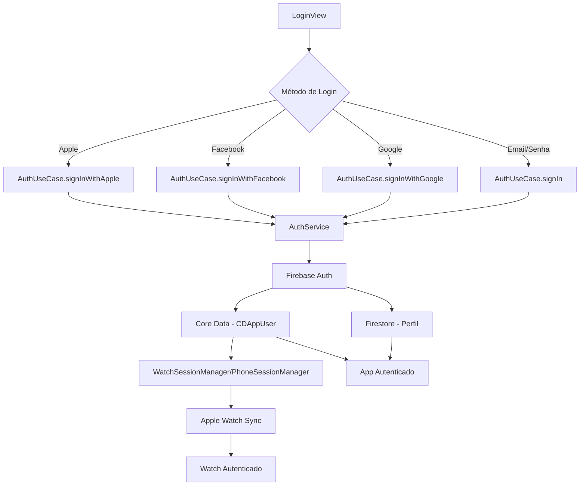

# Fitter V2 - Aplicativo de Treino iOS + watchOS

## 🏗️ **ARQUITETURA ATUAL - CLEAN ARCHITECTURE**

O **Fitter V2** implementa uma arquitetura **Clean Architecture** moderna com foco em **Clean Code**, **Dependency Injection** e **separation of concerns**. O app possui uma estrutura robusta para captura de dados de sensores do Apple Watch, sincronização bidirecional com iPhone, e integração com Firebase para exercícios.

### 🎯 **PRINCÍPIOS ARQUITETURAIS FUNDAMENTAIS**

#### **1. Clean Architecture**
- **Separação de camadas**: Presentation → Domain → Data
- **Dependency Inversion**: Dependências apontam para abstrações (protocols)
- **Single Responsibility**: Cada classe tem uma responsabilidade específica
- **Open/Closed Principle**: Extensível sem modificação

#### **2. Login Obrigatório + Sessão Persistente**
- **Primeira vez**: Login obrigatório (Apple, Google, Facebook, Email)
- **Sessão persistente**: Continua logado automaticamente
- **Logout automático**: Após 7 dias de inatividade por segurança
- **Ownership garantido**: Todos os dados vinculados ao usuário autenticado

#### **3. Injeção de Dependências**
- **@StateObject** no App entry point
- **@EnvironmentObject** nas Views filhas
- **Eliminação de singletons** (exceto infraestrutura compartilhada)
- **Testabilidade** via protocols e mocks

---

## 📁 **ESTRUTURA DO PROJETO ATUALIZADA**

### 🍎 **Fitter V2/** (iOS App)
Aplicativo principal para iPhone com interface SwiftUI e integração completa com Firebase.

#### **Views/**
   - **Auth/**
      - `LoginView.swift` - Tela de login com suporte a email/senha, Google, Facebook e Apple
      - `CreateAccountView.swift` - Tela de criação de conta com validação de dados

   - **Home/**
      - `HomeView.swift` - Dashboard principal com status de conectividade

   - **Workout/**
      - `WorkoutView.swift` - Lista de treinos e navegação principal
      - `WorkoutEditorView.swift` - **UNIFICADO**: Criação e edição de treinos (substitui CreateWorkoutView + DetailWorkoutView)
      - `ListExerciseView.swift` - Lista de exercícios do Firebase com filtros avançados

- **Profile/**
  - `ProfileView.swift` - Perfil e configurações do usuário

- **History/**
  - `HistoryView.swift` - Histórico de treinos realizados

- **MainTab/**
  - `MainTabView.swift` - Navegação principal por abas

#### **ViewsModel/** (Clean Architecture)
- `BaseViewModel.swift` - **NOVO**: ViewModel base com estados comuns e orquestração de Use Cases
- `LoginViewModel.swift` - Herda BaseViewModel, usa AuthUseCase
- `CreateAccountViewModel.swift` - Herda BaseViewModel, usa AuthUseCase
- `WorkoutViewModel.swift` - Herda BaseViewModel, usa Use Cases de Workout
- `ListExerciseViewModel.swift` - Herda BaseViewModel, usa FetchFBExercisesUseCase

#### **Components/**
- `ExerciseCard.swift` - **UNIFICADO**: Card para exercícios Firebase e Core Data (substitui 3 componentes antigos)
- `WorkoutPlanCard.swift` - Card de planos de treino
- `UploadButton.swift` - Botão de upload de treinos
- `ImportWorkoutCard.swift` - Card de status de importação
- `BackButton.swift` - Botão de navegação
- `CreateButton.swift` - Botão de criação

---

### ⌚ **Fitter V2 Watch App/** (watchOS App)
Aplicativo complementar para Apple Watch com sincronização em tempo real.

#### **Views/**
- `WatchView.swift` - Interface principal do treino ativo
- `PendingLoginView.swift` - Aguardando autenticação do iPhone

#### **Managers/**
- `MotionManager.swift` - **REFATORADO**: Captura de dados de sensores (50Hz execução, 20Hz descanso)
- `WorkoutPhaseManager.swift` - **NOVO**: Controle de estados execução/descanso + timer automático
- `WatchSessionManager.swift` - **NOVO**: WCSession no Watch + envio de chunks

#### **Arquivos Principais:**
- `WatchApp.swift` - Ponto de entrada do app watchOS
- `Fitter V2 Watch App.entitlements` - Permissões do Watch

---

### 🔄 **Shared/** (Código Compartilhado - Clean Architecture)
Código compartilhado entre iOS e watchOS organizado por Clean Architecture.

#### **UseCases/** (Camada de Domínio)
**Use Cases de Autenticação:**
- `AuthUseCase.swift` - **NOVO**: Orquestração de todos os fluxos de autenticação

**Use Cases de Workout (CRUD):**
- `CreateWorkoutUseCase.swift` - **NOVO**: Criação de treinos com títulos duais
- `FetchWorkoutUseCase.swift` - **NOVO**: Busca com filtros e estatísticas
- `UpdateWorkoutUseCase.swift` - **NOVO**: Edição com rollback
- `DeleteWorkoutUseCase.swift` - **NOVO**: Exclusão segura
- `ReorderWorkoutUseCase.swift` - **NOVO**: Reordenação de treinos
- `ReorderExerciseUseCase.swift` - **NOVO**: Reordenação de exercícios

**Use Cases de Lifecycle de Workout:**
- `StartWorkoutUseCase.swift` - **NOVO**: Inicia sessão + ativa MotionManager
- `StartExerciseUseCase.swift` - **NOVO**: Inicia exercício individual
- `StartSetUseCase.swift` - **NOVO**: Inicia série + captura sensores
- `EndSetUseCase.swift` - **NOVO**: Finaliza série + rest timer
- `EndExerciseUseCase.swift` - **NOVO**: Finaliza exercício + navegação
- `EndWorkoutUseCase.swift` - **NOVO**: Finaliza treino + histórico

**Use Cases Especializados:**
- `SyncWorkoutUseCase.swift` - **NOVO**: Motor de sincronização
- `FetchFBExercisesUseCase.swift` - **NOVO**: Exercícios Firebase
- `ImportWorkoutUseCase.swift` - **NOVO**: Importação de arquivos

#### **Services/** (Camada de Dados)
- `CoreDataService.swift` - **NOVO**: CRUD genérico para Core Data
- `WorkoutDataService.swift` - **NOVO**: CRUD especializado para entidades de treino
- `ImportWorkoutService.swift` - **NOVO**: Importação de arquivos (OCR, PDF, CSV)

#### **Repository/**
- `FirestoreExerciseRepository.swift` - **REFATORADO**: Repository direto para Firestore

#### **Manager/**
- `ConnectivityManager.swift` - **REFATORADO**: Monitoramento de rede (NWPathMonitor)
- `SessionManager.swift` - **REFATORADO**: Coordenação de sessão (preparado para Use Cases)

#### **Sync/**
- `CloudSyncStatus.swift` - **REFATORADO**: Estados simplificados (pending/synced)
- `CloudSyncManager.swift` - **REFATORADO**: Sincronização genérica para qualquer Syncable

#### **CoreData 2/**
- `FitterModel.xcdatamodeld/` - **ATUALIZADO**: Modelo Core Data com External Storage
- `CoreDataModels.swift` - **REFATORADO**: Extensions sem lógica de negócio
- `CoreDataAdapter.swift` - **REFATORADO**: Serialização/deserialização SensorData

#### **Models/**
- `FirebaseExercise.swift` - **ATUALIZADO**: Modelo alinhado com Firebase + vídeos
- `SensorData.swift` - **REFATORADO**: Struct otimizada para Binary Data
- `MuscleGroup.swift` - Enumeração dos grupos musculares
- `SubscriptionType.swift` - **NOVO**: Tipos de assinatura

#### **Protocols/**
- `ExerciseDisplayable.swift` - **ATUALIZADO**: Protocolo para exibição de exercícios

#### **Network/**
- `NetworkMonitor.swift` - Monitor de conectividade de rede

#### **Utilities/**
- `PreviewDataLoader.swift` - **OBSOLETO**: Será substituído por sistema de mocks
- `PreviewCoreDataStack.swift` - **OBSOLETO**: Será substituído por MockPersistenceController

---

## 🗄️ **ARQUITETURA DE BANCO DE DADOS ATUALIZADA**

### **📊 Visão Geral da Arquitetura**

O Fitter V2 implementa uma arquitetura sofisticada que combina **Core Data local** com **Firebase/Firestore na nuvem**, além de integração completa com **Apple Watch** para coleta de dados de sensores.

#### **Camadas da Arquitetura (Clean Architecture):**
1. **Camada de Apresentação**: Views + ViewModels (SwiftUI)
2. **Camada de Domínio**: Use Cases (lógica de negócio)
3. **Camada de Dados**: Services + Repository + Core Data/Firebase

#### **Fluxo de Dados Geral:**
```
📱 iPhone App ←→ ☁️ Firestore
      ↕
🔄 WatchSessionManager ↔ PhoneSessionManager
      ↕
⌚ Apple Watch ←→ 📊 Sensores (50Hz/20Hz)
```
---

## Diagrama

[Sensores Apple Watch + Captura HealthKit]
                  |                         
                  v                         
            +-----------+               +-----------+
            | Watch App | ↔ WCSession ↔ |  iPhone   |
            +-----------+               +-----------+
                                              |
                                              v
                                      +----------------+
                                      |    CoreData    |
                                      +----------------+
                                              |
                                              v
                                      +----------------+
                                      |   Firestore    |
                                      +----------------+

---

### **🏗️ Modelo Core Data Atualizado (FitterModel)**

#### **🟦 Entidades "Current" (Estado Ativo)**

**`CDCurrentSession`** - Treino em andamento
- `id: UUID` - Identificador único
- `startTime: Date` - Início da sessão
- `endTime: Date?` - Fim da sessão
- `currentExerciseIndex: Int32` - Índice do exercício atual
- `isActive: Bool` - Status ativo/inativo
- **Relacionamentos:**
  - `user: CDAppUser` (1:1) - **OBRIGATÓRIO** (login obrigatório)
  - `plan: CDWorkoutPlan` (1:1)
  - `currentExercise: CDCurrentExercise?` (1:0..1)

**`CDCurrentExercise`** - Exercício atual sendo executado
- `id: UUID` - Identificador único
- `startTime: Date` - Início do exercício
- `endTime: Date?` - Fim do exercício
- `currentSetIndex: Int32` - Índice da série atual
- `isActive: Bool` - Status ativo/inativo
- **Relacionamentos:**
  - `session: CDCurrentSession` (1:1)
  - `template: CDExerciseTemplate` (1:1)
  - `currentSet: CDCurrentSet?` (1:0..1)

**`CDCurrentSet`** - Série atual sendo executada
- **Atributos básicos:**
  - `id: UUID` - Identificador único
  - `order: Int32` - Ordem da série
  - `targetReps: Int32` - Repetições planejadas
  - `actualReps: Int32?` - Repetições executadas
  - `weight: Double` - Peso utilizado
  - `startTime: Date?` - Início da série
  - `endTime: Date?` - Fim da série
  - `timestamp: Date` - Timestamp principal
  - `isActive: Bool` - Status ativo/inativo
  - `restTime: Double?` - Tempo de descanso

- **⚠️ IMPORTANTE**: Dados de sensores NÃO são armazenados em entidades "current"
- **Dados leves apenas**: Para controle de UI e navegação

#### **🟢 Entidades de Planejamento**

**`CDWorkoutPlan`** - Planos de treino criados
- `id: UUID` - Identificador único
- `autoTitle: String` - **NOVO**: Título automático ("Treino A", "Treino B")
- `title: String?` - **NOVO**: Título personalizado opcional
- `createdAt: Date` - Data de criação
- `order: Int32` - Ordem de exibição
- `muscleGroups: String` - Grupos musculares (concatenados)
- `cloudSyncStatus: Int16` - Status de sincronização
- `lastCloudSync: Date?` - Última sincronização
- **Relacionamentos:**
  - `user: CDAppUser` (1:1) - **OBRIGATÓRIO** (login obrigatório)
  - `exercises: Set<CDPlanExercise>` (1:N)
  - `currentSessions: Set<CDCurrentSession>` (1:N)

**`CDPlanExercise`** - Exercícios dentro de um plano
- `id: UUID` - Identificador único
- `order: Int32` - Ordem no plano
- `cloudSyncStatus: Int16` - Status de sincronização
- `lastCloudSync: Date?` - Última sincronização
- **Relacionamentos:**
  - `plan: CDWorkoutPlan` (1:1)
  - `template: CDExerciseTemplate` (1:1)

**`CDExerciseTemplate`** - Templates/cadastros de exercícios
- `id: UUID` - Identificador único local
- `templateId: String` - Identificador Firebase
- `name: String` - Nome do exercício
- `muscleGroup: String` - Grupo muscular
- `legSubgroup: String?` - **NOVO**: Subgrupo (apenas para exercícios de perna)
- `equipment: String` - Equipamento necessário
- `gripVariation: String?` - Variação de pegada
- `description: String?` - **NOVO**: Descrição do exercício
- `videoURL: String?` - **NOVO**: URL do vídeo
- `createdAt: Date?` - **NOVO**: Data de criação
- `updatedAt: Date?` - **NOVO**: Data de atualização
- `cloudSyncStatus: Int16` - Status de sincronização
- `lastCloudSync: Date?` - Última sincronização

#### **🟣 Entidades de Histórico**

**`CDWorkoutHistory`** - Histórico de treinos concluídos
- `id: UUID` - Identificador único
- `date: Date` - Data do treino
- `sensorData: Data?` - **NOVO**: Dados de sensores (External Storage)
- `heartRateData: Data?` - **NOVO**: Dados de frequência cardíaca (External Storage)
- `caloriesData: Data?` - **NOVO**: Dados de calorias (External Storage)
- `cloudSyncStatus: Int16` - Status de sincronização
- `lastCloudSync: Date?` - Última sincronização
- **Relacionamentos:**
  - `user: CDAppUser` (1:1) - **OBRIGATÓRIO** (login obrigatório)
  - `exercises: Set<CDHistoryExercise>` (1:N)

**`CDHistoryExercise`** - Exercícios executados no histórico
- `id: UUID` - Identificador único
- `name: String` - Nome do exercício
- `order: Int32` - Ordem de execução
- `sensorData: Data?` - **NOVO**: Dados de sensores (External Storage)
- `heartRateData: Data?` - **NOVO**: Dados de frequência cardíaca (External Storage)
- `caloriesData: Data?` - **NOVO**: Dados de calorias (External Storage)
- `cloudSyncStatus: Int16` - Status de sincronização
- `lastCloudSync: Date?` - Última sincronização
- **Relacionamentos:**
  - `history: CDWorkoutHistory` (1:1)
  - `sets: Set<CDHistorySet>` (1:N)

**`CDHistorySet`** - Séries executadas com dados de sensores
- **Atributos básicos:** (idênticos ao CDCurrentSet)
- `sensorData: Data?` - **NOVO**: Dados de sensores (External Storage)
- `heartRateData: Data?` - **NOVO**: Dados de frequência cardíaca (External Storage)
- `caloriesData: Data?` - **NOVO**: Dados de calorias (External Storage)
- **Relacionamentos:**
  - `exercise: CDHistoryExercise` (1:1)

#### **👤 Entidade de Usuário**

**`CDAppUser`** - Dados do usuário
- **Atributos pessoais:**
  - `id: UUID` - Identificador único
  - `name: String` - Nome completo
  - `email: String?` - Email
  - `providerId: String` - ID do provedor de auth
  - `provider: String?` - Provedor (Google, Facebook, etc.)
  - `birthDate: Date?` - Data de nascimento
  - `gender: String?` - Gênero
  - `height: Double?` - Altura
  - `weight: Double?` - Peso
  - `profilePictureURL: URI?` - URL da foto
  - `locale: String?` - Localização

- **Atributos de controle:**
  - `createdAt: Date` - Data de criação
  - `updatedAt: Date` - Última atualização
  - `lastLoginDate: Date?` - **NOVO**: Último login (indexado)
  - `subscriptionType: Int16` - **NOVO**: Tipo de assinatura
  - `subscriptionValidUntil: Date?` - **NOVO**: Validade da assinatura (indexado)
  - `subscriptionStartDate: Date?` - **NOVO**: Início da assinatura
  - `cloudSyncStatus: Int16` - Status de sincronização
  - `lastCloudSync: Date?` - Última sincronização

- **Relacionamentos:**
  - `workoutPlans: Set<CDWorkoutPlan>` (1:N)
  - `workoutHistories: Set<CDWorkoutHistory>` (1:N)
  - `currentSession: CDCurrentSession?` (1:0..1)

---

### **🔧 Infraestrutura Core Data Atualizada**

#### **PersistenceController.swift**
- **Responsabilidades:**
  - Configuração centralizada do NSPersistentContainer
  - Gerenciamento de contextos (main + background)
  - Configuração de External Storage para Binary Data
  - Migração automática (Model → FitterModel)
  - Operações de save com tratamento de erro

- **Características:**
  - Singleton para acesso global
  - External Storage configurado para sensorData
  - Contextos otimizados para sync em background
  - Histórico de mudanças habilitado

#### **CoreDataAdapter.swift** (refatorado)
- **Responsabilidades:**
  - Serialização/deserialização SensorData JSON
  - Conversão de dados do Apple Watch para Core Data
  - Mapeamento Dictionary ↔ SensorData para sync Firestore
  - Migração de dados legacy

- **Características:**
  - Adapter Pattern para integração Watch
  - External Storage para Binary Data
  - Versionamento e validação de dados

#### **CoreDataModels.swift** (refatorado)
- **Responsabilidades:**
  - Extensions das entidades Core Data
  - Propriedades convenientes (safeId, safeTitle, etc.)
  - Conversões Set → Array para SwiftUI
  - **LIMPEZA**: Removida lógica de negócio (migrada para Use Cases)

- **Características:**
  - Foco apenas em extensões Core Data
  - Propriedades computed para segurança
  - Conversões para SwiftUI

---

### **☁️ Sistema de Sincronização Atualizado**

#### **CloudSyncStatus.swift**
- **Estados de Sync:**
  - `pending = 0` - ⏳ Aguardando sincronização
  - `synced = 1` - ✅ Sincronizado

#### **CloudSyncManager.swift** (generalizado)
- **Responsabilidades:**
  - Sincronização genérica para qualquer Syncable
  - Gerenciamento de filas de upload/delete
  - Retry automático com back-off
  - Conversão Core Data ↔ Firestore

- **Fluxo de Sincronização:**
  1. **Upload**: Mudanças locais → Firestore
  2. **Download**: Mudanças remotas → Core Data
  3. **Retry**: Falhas retornam para pending
  4. **Filas**: Operações pendentes em background

---

### **🔥 Integração Firebase Atualizada**

#### **FirebaseExercise.swift** (atualizado)
- **Responsabilidades:**
  - Modelo para exercícios do Firestore
  - Conversão para CDExerciseTemplate
  - Conformidade com ExerciseDisplayable

- **Novos campos:**
  - `description: String` - Descrição do exercício
  - `videoURL: String?` - URL do vídeo
  - `thumbnailURL: String?` - URL da thumbnail
  - `createdAt: Date` - Data de criação
  - `updatedAt: Date` - Data de atualização
  - `legSubgroup: String?` - Subgrupo (pernas)

- **Eliminações:**
  - `imageName: String?` - Removido completamente

#### **FirestoreExerciseRepository.swift** (refatorado)
- **Responsabilidades:**
  - Repository direto para Firestore
  - Busca de exercícios com filtros
  - Streaming de vídeos
  - Cache inteligente

- **Características:**
  - Protocol + Implementation para testabilidade
  - Dependency injection via inicializador
  - Operações assíncronas com async/await

---

### **⌚ Componentes Apple Watch Atualizados**

#### **MotionManager.swift** (refatorado)
- **Responsabilidades:**
  - Captura contínua de sensores com frequência variável
  - Fase Execução: 50Hz (0.02s)
  - Fase Descanso: 20Hz (0.05s)
  - Bufferização de 100 amostras por chunk
  - Detecção automática de fases (execução/descanso)
  - Delegação do envio para WatchSessionManager

- **Sensores capturados:**
  - Acelerômetro (X, Y, Z)
  - Giroscópio (X, Y, Z)
  - Gravidade (X, Y, Z)
  - Orientação (Roll, Pitch, Yaw)
  - Campo Magnético (se disponível)

#### **WorkoutPhaseManager.swift** (novo)
- **Responsabilidades:**
  - Controle de estados execução/descanso
  - Timer de descanso automático (10s)
  - Notificações para usuário
  - Ajuste de frequência de captura
  - Override manual de fase
  - Sincronização bidirecional Watch-iPhone

- **Funcionalidades:**
  - Enum WorkoutPhase com samplingRate
  - Timer de descanso com pausa/retomada
  - Ações automáticas após timer
  - Sincronização via WCSession

#### **WatchSessionManager.swift** (novo)
- **Responsabilidades:**
  - Gerenciamento do WCSession no Watch
  - Transferência assíncrona de chunks
  - Gerenciamento de conexão Watch-iPhone
  - Recebimento de comandos do iPhone
  - Envio de heartRate/calories (a cada 2s)
  - Sincronização de treinos Watch → iPhone

- **Funcionalidades:**
  - Implementar WCSessionDelegate
  - Buffer e chunking de dados
  - Envio em background
  - Retry automático
  - Monitoramento de reachability

---

### **🔄 Fluxos de Dados Atualizados**

#### **Fluxo 1: Criação de Plano de Treino (Clean Architecture)**
```
1. UI (WorkoutEditorView)
   ↓ Usuário seleciona exercícios do Firebase
   
2. ViewModel (WorkoutViewModel)
   ↓ Herda BaseViewModel, usa CreateWorkoutUseCase
   
3. Use Case (CreateWorkoutUseCase)
   ↓ Orquestra WorkoutDataService + SyncWorkoutUseCase
   
4. Service (WorkoutDataService)
   ↓ CRUD especializado para entidades de treino
   
5. Sync (SyncWorkoutUseCase)
   ↓ Upload para Firestore via CloudSyncManager
   
6. Watch (WatchSessionManager)
   ↓ Envia planos atualizados para Apple Watch
```

#### **Fluxo 2: FLUXO CORRETO DE NAVEGAÇÃO (GRANULAR - SÉRIES DINÂMICAS):**

> **IMPORTANTE:** Este fluxo foi atualizado para refletir a lógica detalhada em @FLUXO_TREINO_COMPLETO.md

StartWorkoutUseCase → CDCurrentSession + inicia MotionManager
      ↓
StartExerciseUseCase → Próximo exercício + finaliza anterior
      ↓
╔═══ LOOP SÉRIES (DINÂMICO - CONTROLADO PELO USUÁRIO) ══════════════════════════════╗
║ 🎯 **LÓGICA UI:** WorkoutSessionView mostra APENAS 1 série no incio do exercício  ║
║ 🎯 **CONTROLE:** Usuário decide quantas séries fazer via botão "+"                ║
║ 🎯 **FLEXÍVEL:** 1 série mínima, sem máximo definido                              ║
║                                                                                   ║
║ StartSetUseCase → Inicia série atual                                              ║
║       ↓                                                                           ║
║ • Captura contínua de sensores (50 Hz)                                            ║
║ • Chunks enviados a cada 100 amostras                                             ║
║ • ML processa dados em tempo real                                                 ║
║ • UI sincronizada Watch ↔ iPhone                                                  ║
║ • Detecção automática de descanso                                                 ║
║       ↓                                                                           ║
║ EndSetUseCase → Finaliza série atual + persiste                                   ║
║       ↓                                                                           ║
║ 🔄 **DECISÃO DO USUÁRIO:**                                                        ║
║ ├─ Botão "+" → StartSetUseCase (nova série do mesmo exercício)                    ║
║ └─ Botão "Próximo" → EndExerciseUseCase (finalizar exercício)                     ║
╚═══════════════════════════════════════════════════════════════════════════════════╝
      ↓
EndExerciseUseCase → Finaliza exercício + decide próximo passo + salva dados
      ↓
┌─ StartExerciseUseCase → Próximo exercício (se houver exercícios restantes)
│        ↓
│   (volta ao LOOP SÉRIES DINÂMICO)
│
└─ EndWorkoutUseCase → Finaliza treino + finaliza MotionManager + persiste histórico completo

#### **Fluxo 3: Conversão Current → History (Otimizado)**
```
1. EndWorkoutUseCase
   ↓ CDCurrentSession.convertToHistory()
   
2. Criação de CDWorkoutHistory
   ↓ Para cada CDCurrentExercise → CDHistoryExercise
   ↓ Para cada CDCurrentSet → CDHistorySet
   
3. Preservação de dados de sensores
   ↓ sensorData, heartRateData, caloriesData (External Storage)
   ↓ Timestamps e metadados preservados
   
4. Limpeza
   ↓ context.delete(currentSession)
   ↓ user.currentSession = nil
```

---

## 🔐 **SISTEMA DE AUTENTICAÇÃO ATUALIZADO**

### 📱 **Visão Geral do Sistema de Auth**

O Fitter V2 suporta múltiples métodos de autenticação através do **AuthUseCase**, com sincronização automática para Apple Watch.

**Arquivos Principais:**
- `AuthUseCase.swift` - **NOVO**: Use Case central de autenticação
- `AuthService.swift` - Serviço de autenticação (email/senha)
- `LoginViewModel.swift` - Herda BaseViewModel, usa AuthUseCase
- `CreateAccountViewModel.swift` - Herda BaseViewModel, usa AuthUseCase
- `LoginView.swift` - Interface de login
- `CreateAccountView.swift` - Interface de criação de conta

---

### 🔑 **1. Login com Email/Senha (Firebase Auth)**

#### **Fluxo de Login:**
1. **Entrada do Usuário** (`LoginView.swift`)
   - Usuário insere email e senha
   - Validação básica de formato

2. **Processamento** (`LoginViewModel.swift`)
   - Herda BaseViewModel
   - Chama `AuthUseCase.signIn(with:)`
   - Gerencia estados de loading e erro

3. **Autenticação** (`AuthUseCase.swift`)
   ```swift
   func signIn(with credentials: AuthCredentials) async throws -> AuthResult
   ```
   - Orquestra AuthService para autenticação
   - Mapeia erros específicos
   - Sincroniza status com Apple Watch

4. **Sincronização Watch** (via WatchSessionManager)
   - Notifica o Watch sobre mudança de status
   - Transfere dados essenciais do usuário

#### **Fluxo de Criação de Conta:**
1. **Entrada de Dados** (`CreateAccountView.swift`)
   - Nome, email, senha, confirmação

2. **Validação** (`CreateAccountViewModel.swift`)
   - Herda BaseViewModel
   - Validação de força da senha
   - Verificação de email válido

3. **Criação** (`AuthUseCase.swift`)
   ```swift
   func createAccount(with registration: AuthRegistration) async throws -> AuthResult
   ```
   - Orquestra AuthService para criação
   - Salva perfil no Firestore
   - Atualiza displayName do usuário

---

### 🔵 **2. Login Social (Google, Facebook, Apple)**

#### **Configuração:**
- `GoogleService-Info.plist` - Configuração do projeto Firebase
- SDKs integrados: Google Sign-In, Facebook Login, Apple Sign In

#### **Fluxo Unificado:**
1. **Iniciação** (`LoginView.swift`)
   - Botões para cada provedor
   - Chama métodos específicos do AuthUseCase

2. **Autenticação** (`AuthUseCase.swift`)
   ```swift
   func signInWithGoogle() async throws -> AuthResult
   func signInWithFacebook() async throws -> AuthResult
   func signInWithApple() async throws -> AuthResult
   ```
   - Orquestra autenticação específica
   - Integração com Firebase
   - Sincronização automática

3. **Integração Firebase:**
   - Cria credenciais específicas do provedor
   - Autentica no Firebase
   - Salva/atualiza dados no Firestore

4. **Sincronização:**
   - Cria/atualiza `CDAppUser` no Core Data
   - Notifica Apple Watch via WatchSessionManager

---

### ⌚ **3. Integração com Apple Watch**

#### **Arquivos Envolvidos:**
- `WatchSessionManager.swift` - Comunicação Watch ↔ iPhone (no Watch)
- `PhoneSessionManager.swift` - Comunicação Watch ↔ iPhone (no iPhone)

#### **Fluxo de Sincronização:**

1. **Detecção de Login** (iPhone)
   ```swift
   // AuthUseCase.swift
   // WatchSessionManager/PhoneSessionManager são responsáveis pela comunicação
   ```

2. **Envio de Dados** (`WatchSessionManager.swift`)
   ```swift
   // WatchSessionManager.swift
   // Exemplo: Envio de status de autenticação para o iPhone
   try await sendMessage(["type": "authStatus", "isAuthenticated": true])
   ```
   - Envia status de autenticação
   - Transfere dados essenciais do usuário
   - Sincroniza planos de treino

3. **Recepção no Watch** (Watch App)
   - Atualiza estado de autenticação
   - Carrega dados do usuário
   - Habilita funcionalidades do Watch

4. **Comunicação Bidirecional:**
   - **iPhone → Watch:** Status auth, planos de treino
   - **Watch → iPhone:** Dados de sensores, progresso de treino

#### **Dados Sincronizados:**
- Status de autenticação (logado/deslogado)
- Informações básicas do usuário
- Planos de treino ativos
- Dados de sensores e métricas

---

### 🗄️ **4. Integração com Firebase**

#### **Serviços Utilizados:**
- **Firebase Auth** - Autenticação multi-provider
- **Firestore** - Banco de dados de exercícios e perfis
- **Firebase Storage** - Vídeos de exercícios

#### **Fluxo de Dados:**

1. **Autenticação** (`AuthUseCase.swift`)
   - Login via Firebase Auth
   - Suporte a múltiplos providers

2. **Perfil do Usuário** (Firestore)
   ```
   Collection: users/{uid}
   - name: String
   - email: String  
   - photoURL: String
   - createdAt: Timestamp
   - updatedAt: Timestamp
   ```

3. **Exercícios** (`FirestoreExerciseRepository.swift`)
   ```
   Collection: exercisesList
   - templateId: String
   - name: String
   - muscleGroup: String
   - equipment: String
   - gripVariation: String?
   - description: String
   - videoURL: String?
   - thumbnailURL: String?
   ```

4. **Sincronização Local** (`WorkoutDataService.swift`)
   - Converte exercícios Firebase → Core Data
   - Mantém cache local para offline
   - Sincronização bidirecional

---

### 🔄 **5. Fluxo Completo de Autenticação**



---

### 🛡️ **6. Segurança e Tratamento de Erros**

#### **Tipos de Erro** (`AuthUseCaseError`)
- `invalidCredentials` - Credenciais inválidas
- `weakPassword` - Senha fraca (< 6 caracteres)
- `emailAlreadyInUse` - Email já cadastrado
- `userNotFound` - Usuário não encontrado
- `networkError` - Erro de conectividade
- `providerError` - Erro no provedor social
- `unknownError` - Erro inesperado

#### **Mapeamento de Erros** (`AuthUseCase.mapError()`)
- Converte erros específicos para mensagens user-friendly
- Tratamento específico por tipo de erro
- Logs detalhados para debugging

---

### 📊 **7. Estados da Aplicação**

#### **Estados de Autenticação:**
- `isAuthenticated: Bool` - Status global
- `currentUser: CDAppUser!` - **OBRIGATÓRIO**: Usuário atual (nunca nil após login)
- `isLoading: Bool` - Estados de carregamento
- `errorMessage: String?` - Mensagens de erro

#### **Sincronização com Watch:**
- `isReachable: Bool` - Watch conectado
- Status de sincronização em tempo real

---

## 🎯 **SISTEMA DE VÍDEO E EXERCÍCIOS**

### **🎯 ExerciseCard Unificado**
```swift
ExerciseCard.swift (597 linhas)
├── Mode.firebaseList (seleção de exercícios)
├── Mode.workoutEditor (criação/edição de treinos)
├── Mode.details (visualização de detalhes)
├── Modal de vídeo 1:1 com descrição
└── 70% menos código vs 3 componentes antigos
```

### **🔥 Firebase Integration Atualizada**
```swift
FirebaseExercise:
├── videoURL (streaming via Firebase Storage)
├── thumbnailURL (preview otimizada)
├── description (detalhes do exercício)
├── legSubgroup (exercícios de perna)
├── createdAt/updatedAt (timestamps)
└── Suporte completo a vídeos
```

---

## 🏆 **CONCLUSÃO**

O **Fitter** possui uma arquitetura **robusta e moderna** baseada em Clean Architecture, com separação clara de responsabilidades e foco em testabilidade. A estrutura atual suporta:

- ✅ **Captura contínua** de dados de sensores (50Hz/20Hz)
- ✅ **Sincronização bidirecional** Watch ↔ iPhone
- ✅ **Integração Firebase** para exercícios com vídeos
- ✅ **Sistema de autenticação** completo (multi-provider)
- ✅ **Persistência otimizada** com External Storage
- ✅ **UI reativa** com SwiftUI
- ✅ **Login obrigatório** com sessão persistente
- ✅ **Logout automático** por inatividade (7 dias)

A refatoração em andamento está **61% concluída**, com foco em eliminar violações arquiteturais e completar a migração para Clean Architecture. O app está bem posicionado para escalabilidade e manutenibilidade futuras.

---

*Este README documenta a arquitetura completa e atualizada do Fitter V2. Para mais detalhes técnicos sobre a refatoração em andamento, consulte o arquivo REFATORAÇÃO.md.* 