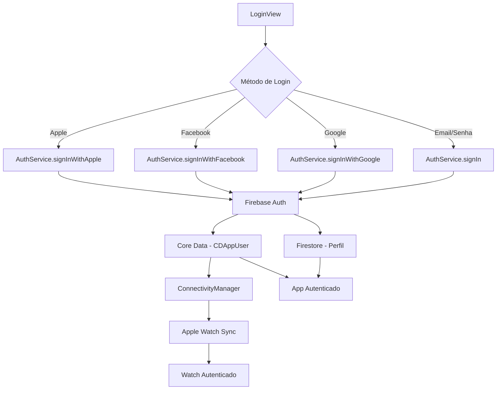

# Fitter V2 - Aplicativo de Treino iOS + watchOS

## 📁 Estrutura do Projeto

### 🍎 **Fitter V2/** (iOS App)
Aplicativo principal para iPhone com interface SwiftUI e integração completa com Firebase.

#### **Views/**
- **Auth/**
  - `LoginView.swift` - Tela de login com suporte a email/senha, Google, Facebook e Apple
  - `CreateAccountView.swift` - Tela de criação de conta com validação de dados

- **Home/**
  - Telas principais do dashboard e navegação

- **Workout/**
  - `CreateWorkoutView.swift` - Criação de novos planos de treino
  - `ListExerciseView.swift` - Lista de exercícios do Firebase com filtros avançados
  - `WorkoutView.swift` - Execução e acompanhamento de treinos
  - `DetailWorkoutView.swift` - Detalhes e visualização de planos de treino

- **Profile/**
  - Telas de perfil e configurações do usuário

- **History/**
  - Histórico de treinos realizados

- **MainTab/**
  - Navegação principal por abas

#### **ViewModels/**
- `LoginViewModel.swift` - Lógica de autenticação e validação de login
- `CreateAccountViewModel.swift` - Lógica de criação de conta
- `WorkoutViewModel.swift` - Gerenciamento de planos de treino e exercícios
- `ListExerciseViewModel.swift` - Filtros e busca de exercícios do Firebase

#### **Services/**
- `AuthService.swift` - Serviço principal de autenticação (Firebase, Google, Facebook, Apple)
- `FirebaseExerciseService.swift` - Gerenciamento de exercícios do Firestore
- `WorkoutService.swift` - Integração entre Firebase e CoreData para treinos

#### **Models/**
- `FirebaseExercise.swift` - Modelo de exercícios do Firestore

#### **Components/**
- Componentes reutilizáveis da interface (cards, botões, etc.)

#### **Sync/**
- Sincronização de dados entre dispositivos

#### **Assets.xcassets/**
- Recursos visuais (imagens, ícones, cores)

#### **Arquivos de Configuração:**
- `iOSApp.swift` - Ponto de entrada do app iOS
- `GoogleService-Info.plist` - Configuração do Firebase/Google
- `Fitter V2.entitlements` - Permissões e capabilities

---

### ⌚ **Fitter V2 Watch App/** (watchOS App)
Aplicativo complementar para Apple Watch com sincronização em tempo real.

#### **Views/**
- Interface específica do Apple Watch

#### **ViewModels/**
- Lógica de negócio adaptada para watchOS

#### **Managers/**
- `MotionManager.swift` - Captura de dados de sensores (CoreMotion + HealthKit)

#### **Data/**
- `WatchDataManager.swift` - Gerenciamento de dados no Apple Watch

#### **Arquivos Principais:**
- `WatchApp.swift` - Ponto de entrada do app watchOS
- `Fitter V2 Watch App.entitlements` - Permissões do Watch

---

### 🔄 **Shared/** (Código Compartilhado)
Código compartilhado entre iOS e watchOS para máxima reutilização.

#### **CoreData 2/**
- `Model.xcdatamodeld/` - Modelo de dados Core Data
- `CoreDataStack.swift` - Configuração e gerenciamento do Core Data
- `CoreDataModels.swift` - Extensions e business logic das entidades
- `CoreDataAdapter.swift` - Adaptador para integração com Apple Watch

#### **Models/**
- `MuscleGroup.swift` - Enumeração dos grupos musculares

#### **Services/**
- Serviços compartilhados entre plataformas

#### **Protocols/**
- `ExerciseDisplayable.swift` - Protocolo para exibição de exercícios
- Outros protocolos compartilhados

#### **Manager/**
- `WorkoutManager.swift` - Gerenciador principal de treinos
- `ConnectivityManager.swift` - Comunicação entre iPhone e Apple Watch
- `SessionManager.swift` - Gerenciamento de sessões de treino

#### **Repository/**
- `WorkoutRepository.swift` - Implementação do padrão Repository
- `WorkoutRepositoryProtocol.swift` - Interface do repositório de dados

#### **Persistence/**
- `PersistenceController.swift` - Controlador de persistência Core Data

#### **Utilities/**
- `PreviewDataLoader.swift` - População de dados para previews
- `PreviewCoreDataStack.swift` - Core Data em memória para desenvolvimento

#### **Network/**
- `NetworkMonitor.swift` - Monitor de conectividade de rede

#### **Sync/**
- `CloudSyncStatus.swift` - Status e protocolo de sincronização
- `CloudSyncManager.swift` - Gerenciador de sincronização com Firestore

---

## 🗄️ **Arquitetura de Banco de Dados**

### **📊 Visão Geral da Arquitetura**

O Fitter V2 implementa uma arquitetura sofisticada que combina **Core Data local** com **Firebase/Firestore na nuvem**, além de integração completa com **Apple Watch** para coleta de dados de sensores.

#### **Camadas da Arquitetura:**
1. **Camada de Dados**: Core Data (local) + Firestore (nuvem)
2. **Camada de Sincronização**: CloudSyncManager + CloudSyncStatus
3. **Camada de Repositório**: WorkoutRepository + WorkoutRepositoryProtocol
4. **Camada de Serviço**: WorkoutService + FirebaseExerciseService
5. **Camada de Gerenciamento**: WorkoutManager
6. **Camada de Apresentação**: WorkoutViewModel
7. **Camada Apple Watch**: WatchDataManager + MotionManager

#### **Fluxo de Dados Geral:**
```
📱 iPhone App ←→ ☁️ Firestore
      ↕
🔄 ConnectivityManager
      ↕
⌚ Apple Watch ←→ 📊 Sensores
```

---

### **🏗️ Modelo Core Data**

#### **🟦 Entidades "Vivas" (Estado Ativo)**

**`CDCurrentSession`** - Treino em andamento
- `id: UUID` - Identificador único
- `startTime: Date` - Início da sessão
- `endTime: Date?` - Fim da sessão
- `currentExerciseIndex: Int32` - Índice do exercício atual
- `isActive: Bool` - Status ativo/inativo
- **Relacionamentos:**
  - `user: CDAppUser` (1:1)
  - `plan: CDWorkoutPlan` (1:1)
  - `currentExercise: CDCurrentExercise?` (1:0..1)

**`CDCurrentExercise`** - Exercício atual sendo executado
- `id: UUID` - Identificador único
- `startTime: Date` - Início do exercício
- `endTime: Date?` - Fim do exercício
- `currentSetIndex: Int32` - Índice da série atual
- `isActive: Bool` - Status ativo/inativo
- **Relacionamentos:**
  - `session: CDCurrentSession` (1:1)
  - `template: CDExerciseTemplate` (1:1)
  - `currentSet: CDCurrentSet?` (1:0..1)

**`CDCurrentSet`** - Série atual sendo executada
- **Atributos básicos:**
  - `id: UUID` - Identificador único
  - `order: Int32` - Ordem da série
  - `targetReps: Int32` - Repetições planejadas
  - `actualReps: Int32?` - Repetições executadas
  - `weight: Double` - Peso utilizado
  - `startTime: Date?` - Início da série
  - `endTime: Date?` - Fim da série
  - `timestamp: Date` - Timestamp principal
  - `isActive: Bool` - Status ativo/inativo
  - `restTime: Double?` - Tempo de descanso

- **Dados de sensores (Apple Watch):**
  - `accelerationX/Y/Z: Double?` - Acelerômetro (3 eixos)
  - `rotationX/Y/Z: Double?` - Giroscópio (3 eixos)
  - `gravityX/Y/Z: Double?` - Gravidade (3 eixos)
  - `attitudeRoll/Pitch/Yaw: Double?` - Orientação (3 eixos)
  - `heartRate: Int32?` - Frequência cardíaca
  - `caloriesBurned: Double?` - Calorias queimadas

#### **🟢 Entidades de Planejamento**

**`CDWorkoutPlan`** - Planos de treino criados
- `id: UUID` - Identificador único
- `title: String` - Nome do plano
- `createdAt: Date` - Data de criação
- `order: Int32` - Ordem de exibição
- `muscleGroups: String` - Grupos musculares (concatenados)
- `cloudSyncStatus: Int16` - Status de sincronização
- `lastCloudSync: Date?` - Última sincronização
- **Relacionamentos:**
  - `user: CDAppUser` (1:1)
  - `exercises: Set<CDPlanExercise>` (1:N)
  - `currentSessions: Set<CDCurrentSession>` (1:N)

**`CDPlanExercise`** - Exercícios dentro de um plano
- `id: UUID` - Identificador único
- `order: Int32` - Ordem no plano
- `cloudSyncStatus: Int16` - Status de sincronização
- `lastCloudSync: Date?` - Última sincronização
- **Relacionamentos:**
  - `plan: CDWorkoutPlan` (1:1)
  - `template: CDExerciseTemplate` (1:1)

**`CDExerciseTemplate`** - Templates/cadastros de exercícios
- `id: UUID` - Identificador único local
- `templateId: String` - Identificador Firebase
- `name: String` - Nome do exercício
- `muscleGroup: String` - Grupo muscular
- `legSubgroup: String?` - Subgrupo (pernas)
- `equipment: String` - Equipamento necessário
- `gripVariation: String?` - Variação de pegada
- `imageName: String?` - Nome da imagem
- `cloudSyncStatus: Int16` - Status de sincronização
- `lastCloudSync: Date?` - Última sincronização

#### **🟣 Entidades de Histórico**

**`CDWorkoutHistory`** - Histórico de treinos concluídos
- `id: UUID` - Identificador único
- `date: Date` - Data do treino
- `cloudSyncStatus: Int16` - Status de sincronização
- `lastCloudSync: Date?` - Última sincronização
- **Relacionamentos:**
  - `user: CDAppUser` (1:1)
  - `exercises: Set<CDHistoryExercise>` (1:N)

**`CDHistoryExercise`** - Exercícios executados no histórico
- `id: UUID` - Identificador único
- `name: String` - Nome do exercício
- `order: Int32` - Ordem de execução
- `cloudSyncStatus: Int16` - Status de sincronização
- `lastCloudSync: Date?` - Última sincronização
- **Relacionamentos:**
  - `history: CDWorkoutHistory` (1:1)
  - `sets: Set<CDHistorySet>` (1:N)

**`CDHistorySet`** - Séries executadas com dados de sensores
- **Atributos básicos:** (idênticos ao CDCurrentSet)
- **Dados de sensores:** (todos os 11 canais preservados)
- **Relacionamentos:**
  - `exercise: CDHistoryExercise` (1:1)

#### **👤 Entidade de Usuário**

**`CDAppUser`** - Dados do usuário
- **Atributos pessoais:**
  - `id: UUID` - Identificador único
  - `name: String` - Nome completo
  - `email: String?` - Email
  - `providerId: String` - ID do provedor de auth
  - `provider: String?` - Provedor (Google, Facebook, etc.)
  - `birthDate: Date` - Data de nascimento
  - `gender: String?` - Gênero
  - `height: Double` - Altura
  - `weight: Double` - Peso
  - `profilePictureURL: URI?` - URL da foto
  - `locale: String?` - Localização

- **Atributos de controle:**
  - `createdAt: Date` - Data de criação
  - `updatedAt: Date` - Última atualização
  - `lastLoginDate: Date?` - Último login
  - `cloudSyncStatus: Int16` - Status de sincronização
  - `lastCloudSync: Date?` - Última sincronização

- **Relacionamentos:**
  - `workoutPlans: Set<CDWorkoutPlan>` (1:N)
  - `workoutHistories: Set<CDWorkoutHistory>` (1:N)
  - `currentSession: CDCurrentSession?` (1:0..1)

---

### **🔧 Infraestrutura Core Data**

#### **CoreDataStack.swift**
- **Responsabilidades:**
  - Configuração centralizada do NSPersistentContainer
  - Gerenciamento de contextos (main + background)
  - Configuração de sincronização automática
  - Suporte a banco pré-populado
  - Operações de save com tratamento de erro

- **Características:**
  - Singleton para acesso global
  - Contextos otimizados para sync em background
  - Histórico de mudanças habilitado
  - Migração automática entre versões

#### **CoreDataAdapter.swift**
- **Responsabilidades:**
  - Conversão de dados do Apple Watch para Core Data
  - Criação de CDHistorySet a partir de dados de sensores
  - Mapeamento de dados de movimento (11 canais de sensores)

- **Características:**
  - Adapter Pattern para integração Watch
  - Processamento de todos os canais de sensores
  - Marcação automática para sincronização

#### **CoreDataModels.swift**
- **Responsabilidades:**
  - Extensions das entidades Core Data
  - Métodos de negócio (startWorkout, endWorkout, nextExercise)
  - Conversões seguras (safeId, safeName, etc.)
  - Lógica de conversão Current → History

- **Características:**
  - Business logic diretamente nas entidades
  - Fluxo completo de gestão de sessões
  - Conversão automática Current → History
  - Propriedades computed para segurança

---

### **☁️ Sistema de Sincronização**

#### **CloudSyncStatus.swift**
- **Estados de Sync:**
  - `synced = 0` - ✅ Sincronizado
  - `pendingUpload = 1` - ⏳ Esperando upload
  - `uploading = 2` - ⬆️ Fazendo upload
  - `conflict = 3` - ⚠️ Conflito detectado
  - `error = 4` - ❌ Erro na sincronização

- **Estratégias de Resolução de Conflitos:**
  - `localWins` - Local sempre ganha
  - `remoteWins` - Remote sempre ganha
  - `lastModified` - Último modificado ganha
  - `manual` - Resolução manual pelo usuário

#### **CloudSyncManager.swift**
- **Responsabilidades:**
  - Sincronização bidirecional com Firestore
  - Gerenciamento de filas de upload/delete
  - Resolução automática de conflitos
  - Conversão Core Data ↔ Firestore

- **Fluxo de Sincronização:**
  1. **Upload**: Mudanças locais → Firestore
  2. **Download**: Mudanças remotas → Core Data
  3. **Conflitos**: Estratégias configuráveis
  4. **Filas**: Operações pendentes em background

---

### **🔥 Integração Firebase**

#### **FirebaseExercise.swift**
- **Responsabilidades:**
  - Modelo para exercícios do Firestore
  - Conversão para CDExerciseTemplate
  - Conformidade com ExerciseDisplayable

- **Características:**
  - Struct para exercícios da coleção "exercisesList"
  - Método de conversão para Core Data
  - Hashable para seleção e comparação

#### **FirebaseExerciseService.swift**
- **Responsabilidades:**
  - Carregamento de exercícios do Firestore
  - Cache local (opcional)
  - Listeners em tempo real
  - Filtros por grupo muscular e equipamento

- **Características:**
  - `@MainActor` para operações na thread principal
  - Carregamento on-demand e listeners opcionais
  - Filtros inteligentes com priorização

---

### **⌚ Componentes Apple Watch**

#### **WatchDataManager.swift**
- **Responsabilidades:**
  - Gerenciamento centralizado de dados no Apple Watch
  - Recepção e armazenamento de dados do iPhone
  - Cache local de dados pendentes (UserDefaults)
  - Sincronização bidirecional com iPhone
  - Mapeamento de contexto de sessão ativa

- **Estados Gerenciados:**
  - `workoutPlans: [WatchWorkoutPlan]` - Planos recebidos do iPhone
  - `pendingSensorData: [WatchSensorData]` - Dados aguardando sincronização
  - `isConnectedToPhone: Bool` - Status de conectividade
  - `currentSessionContext: WatchSessionContext?` - Contexto da sessão ativa

- **Sistema de Contexto:**
  ```swift
  struct WatchSessionContext: Codable {
      let sessionId: String
      let planId: String
      let currentSetId: String        // ⭐ CHAVE para mapear sensores
      let currentExerciseId: String
      let isActive: Bool
  }
  ```

#### **MotionManager.swift**
- **Responsabilidades:**
  - Integração com CoreMotion e HealthKit
  - Captura de dados de sensores em tempo real (30Hz)
  - Gerenciamento de sessões de treino
  - Processamento e filtragem de dados (30Hz → 2Hz)
  - Comunicação com WatchConnectivity

- **Integração Dupla:**
  - **CoreMotion**: Dados de movimento (acelerômetro, giroscópio, etc.)
  - **HealthKit**: Frequência cardíaca, calorias, sessão oficial

- **Dados de Sensores (11 canais):**
  ```swift
  struct WatchSensorData: Codable {
      // Movimento
      let accelerationX/Y/Z: Double?    // Acelerômetro
      let rotationX/Y/Z: Double?        // Giroscópio
      let gravityX/Y/Z: Double?         // Gravidade
      let attitudeRoll/Pitch/Yaw: Double? // Orientação
      
      // Saúde
      let heartRate: Int?
      let calories: Double?
      
      // Mapeamento com Core Data
      let setId: UUID?        // CDCurrentSet.id
      let sessionId: UUID?    // CDCurrentSession.id
  }
  ```

---

### **🔄 Fluxos de Dados Completos**

#### **Fluxo 1: Criação de Plano de Treino**
```
1. UI (ListExerciseView)
   ↓ Usuário seleciona exercícios do Firebase
   
2. ViewModel (WorkoutViewModel)
   ↓ Gerencia selectedExercises: Set<String>
   
3. Service (WorkoutService)
   ↓ Converte FirebaseExercise → CDExerciseTemplate
   
4. Manager (WorkoutManager)
   ↓ Cria CDWorkoutPlan + CDPlanExercise
   
5. Repository (WorkoutRepository)
   ↓ Persiste no Core Data
   ↓ Marca cloudSyncStatus = .pendingUpload
   
6. Sync (CloudSyncManager)
   ↓ Upload para Firestore collection "workoutPlans"
   
7. Watch (ConnectivityManager)
   ↓ Envia planos atualizados para Apple Watch
```

#### **Fluxo 2: Execução de Treino com Apple Watch**
```
1. iPhone: CDCurrentSession criada com UUID
   ↓ CDCurrentExercise + CDCurrentSet criados
   
2. ConnectivityManager (iPhone)
   ↓ Envia WatchSessionContext com currentSetId
   
3. WatchDataManager (Watch)
   ↓ Armazena contexto com IDs para mapeamento
   
4. MotionManager (Watch)
   ↓ Captura sensores (30Hz) → Filtra (2Hz)
   ↓ Vincula dados ao currentSetId
   
5. WatchSensorData
   ↓ 11 canais de sensores + mapeamento de IDs
   
6. Sincronização (Watch → iPhone)
   ↓ CoreDataAdapter converte para CDHistorySet
   ↓ CloudSyncManager agenda upload para Firestore
```

#### **Fluxo 3: Conversão Current → History**
```
1. CDAppUser.endWorkout()
   ↓ CDCurrentSession.convertToHistory()
   
2. Criação de CDWorkoutHistory
   ↓ Para cada CDCurrentExercise → CDHistoryExercise
   ↓ Para cada CDCurrentSet → CDHistorySet
   
3. Preservação de dados de sensores
   ↓ Todos os 11 canais mantidos no histórico
   ↓ Timestamps e metadados preservados
   
4. Limpeza
   ↓ context.delete(currentSession)
   ↓ user.currentSession = nil
```

---

### **💡 Pontos Fortes da Arquitetura**

1. **Separação Clara de Responsabilidades**
   - Cada camada tem função específica e bem definida
   - Baixo acoplamento entre componentes

2. **Offline-First com Sync Inteligente**
   - Core Data como fonte de verdade local
   - Sincronização eventual com Firestore
   - Resolução automática de conflitos

3. **Integração Apple Watch Avançada**
   - **11 canais de sensores**: Dados completos de movimento
   - **Mapeamento inteligente**: setId vincula dados à série correta
   - **Performance otimizada**: 30Hz → 2Hz filtering
   - **Cache resiliente**: UserDefaults para dados pendentes

4. **Flexibilidade de Fontes de Dados**
   - **Exercícios**: Firebase (fonte) → Core Data (cache)
   - **Planos**: Core Data (criação) → Firestore (sync)
   - **Histórico**: Core Data + dados de sensores

5. **Type Safety e Protocolos**
   - **ExerciseDisplayable**: Interface comum para exercícios
   - **CloudSyncable**: Protocolo de sincronização
   - **Repository Pattern**: Abstração de persistência

6. **Preview Support**
   - Sistema completo de dados mock
   - Core Data em memória para desenvolvimento
   - Isolamento do ambiente de preview

---

## 🔐 Fluxo de Autenticação

### 📱 **Visão Geral do Sistema de Auth**

O Fitter V2 suporta múltiples métodos de autenticação através do Firebase Auth, com sincronização automática para Apple Watch.

**Arquivos Principais:**
- `AuthService.swift` - Serviço central de autenticação
- `LoginViewModel.swift` - Lógica da tela de login
- `CreateAccountViewModel.swift` - Lógica de criação de conta
- `LoginView.swift` - Interface de login
- `CreateAccountView.swift` - Interface de criação de conta
- `ConnectivityManager.swift` - Sincronização com Apple Watch

---

### 🔑 **1. Login com Email/Senha (Firebase Auth)**

#### **Fluxo de Login:**
1. **Entrada do Usuário** (`LoginView.swift`)
   - Usuário insere email e senha
   - Validação básica de formato

2. **Processamento** (`LoginViewModel.swift`)
   - Chama `AuthService.signIn(email:password:)`
   - Gerencia estados de loading e erro

3. **Autenticação** (`AuthService.swift`)
   ```swift
   func signIn(email: String, password: String) async throws
   ```
   - Autentica via `Firebase.Auth.auth().signIn()`
   - Mapeia erros específicos do Firebase
   - Sincroniza status com Apple Watch

4. **Sincronização Watch** (`ConnectivityManager.swift`)
   - `sendAuthStatusToWatch()` notifica o Watch
   - Transfere dados essenciais do usuário

#### **Fluxo de Criação de Conta:**
1. **Entrada de Dados** (`CreateAccountView.swift`)
   - Nome, email, senha, confirmação

2. **Validação** (`CreateAccountViewModel.swift`)
   - Validação de força da senha
   - Verificação de email válido

3. **Criação** (`AuthService.swift`)
   ```swift
   func createAccount(name: String, email: String, password: String) async throws
   ```
   - Cria usuário no Firebase Auth
   - Salva perfil no Firestore
   - Atualiza displayName do usuário

---

### 🔵 **2. Login com Google (Google Sign-In)**

#### **Configuração:**
- `GoogleService-Info.plist` - Configuração do projeto Firebase
- Google Sign-In SDK integrado

#### **Fluxo:**
1. **Iniciação** (`LoginView.swift`)
   - Botão "Entrar com Google"
   - Chama `AuthService.signInWithGoogle()`

2. **Autenticação Google** (`AuthService.swift`)
   ```swift
   func signInWithGoogle() async throws
   ```
   - Configura `GIDConfiguration` com clientID do Firebase
   - Apresenta tela de login do Google
   - Obtém tokens de acesso e ID

3. **Integração Firebase:**
   - Cria `GoogleAuthProvider.credential()`
   - Autentica no Firebase com credencial Google
   - Salva/atualiza dados no Firestore

4. **Sincronização:**
   - Cria/atualiza `CDAppUser` no Core Data
   - Notifica Apple Watch via `ConnectivityManager`

---

### 🔵 **3. Login com Facebook (Facebook Login)**

#### **Configuração:**
- Facebook SDK integrado
- Permissões: `["public_profile", "email"]`

#### **Fluxo:**
1. **Iniciação** (`LoginView.swift`)
   - Botão "Entrar com Facebook"
   - Chama `AuthService.signInWithFacebook()`

2. **Autenticação Facebook** (`AuthService.swift`)
   ```swift
   func signInWithFacebook() async throws
   ```
   - Usa `LoginManager` do Facebook SDK
   - Solicita permissões de perfil e email
   - Obtém `AccessToken`

3. **Integração Firebase:**
   - Cria `FacebookAuthProvider.credential()`
   - Autentica no Firebase
   - Salva dados do perfil no Firestore

4. **Tratamento de Erros:**
   - Login cancelado pelo usuário
   - Erros de rede ou permissão
   - Mapeamento para `AuthError.facebookSignInError`

---

### 🍎 **4. Login com Apple (Sign in with Apple)**

#### **Configuração:**
- `Fitter V2.entitlements` - Capability "Sign in with Apple"
- AuthenticationServices framework

#### **Fluxo (Implementação Pendente):**
1. **Interface** - Botão nativo do Apple Sign In
2. **Autenticação** - `ASAuthorizationAppleIDProvider`
3. **Integração Firebase** - `OAuthProvider.credential()`
4. **Sincronização** - Mesmo fluxo dos outros métodos

---

### ⌚ **5. Integração com Apple Watch**

#### **Arquivos Envolvidos:**
- `ConnectivityManager.swift` (Shared)
- `WatchApp.swift` (Watch App)
- Managers específicos do Watch

#### **Fluxo de Sincronização:**

1. **Detecção de Login** (iPhone)
   ```swift
   // AuthService.swift
   ConnectivityManager.shared.sendAuthStatusToWatch()
   ```

2. **Envio de Dados** (`ConnectivityManager.swift`)
   ```swift
   func sendMessage(_ message: [String: Any], replyHandler: ...)
   ```
   - Envia status de autenticação
   - Transfere dados essenciais do usuário
   - Sincroniza planos de treino

3. **Recepção no Watch** (Watch App)
   - Atualiza estado de autenticação
   - Carrega dados do usuário
   - Habilita funcionalidades do Watch

4. **Comunicação Bidirecional:**
   - **iPhone → Watch:** Status auth, planos de treino
   - **Watch → iPhone:** Dados de sensores, progresso de treino

#### **Dados Sincronizados:**
- Status de autenticação (logado/deslogado)
- Informações básicas do usuário
- Planos de treino ativos
- Dados de sensores e métricas

---

### 🗄️ **6. Integração com Firebase**

#### **Serviços Utilizados:**
- **Firebase Auth** - Autenticação multi-provider
- **Firestore** - Banco de dados de exercícios e perfis
- **Firebase Storage** - (Futuro) Imagens de exercícios

#### **Fluxo de Dados:**

1. **Autenticação** (`AuthService.swift`)
   - Login via Firebase Auth
   - Suporte a múltiplos providers

2. **Perfil do Usuário** (Firestore)
   ```
   Collection: users/{uid}
   - name: String
   - email: String  
   - photoURL: String
   - createdAt: Timestamp
   - updatedAt: Timestamp
   ```

3. **Exercícios** (`FirebaseExerciseService.swift`)
   ```
   Collection: exercisesList
   - templateId: String
   - name: String
   - muscleGroup: String
   - equipment: String
   - gripVariation: String?
   ```

4. **Sincronização Local** (`WorkoutService.swift`)
   - Converte exercícios Firebase → Core Data
   - Mantém cache local para offline
   - Sincronização bidirecional

---

### 🔄 **7. Fluxo Completo de Autenticação**



---

### 🛡️ **8. Segurança e Tratamento de Erros**

#### **Tipos de Erro** (`AuthError`)
- `invalidEmail` - Email inválido
- `weakPassword` - Senha fraca (< 6 caracteres)
- `emailAlreadyInUse` - Email já cadastrado
- `userNotFound` - Usuário não encontrado
- `wrongPassword` - Senha incorreta
- `networkError` - Erro de conectividade
- `googleSignInError` - Erro no login Google
- `facebookSignInError` - Erro no login Facebook

#### **Mapeamento de Erros** (`AuthService.mapFirebaseError()`)
- Converte erros do Firebase para mensagens user-friendly
- Tratamento específico por tipo de erro
- Logs detalhados para debugging

---

### 📊 **9. Estados da Aplicação**

#### **Estados de Autenticação:**
- `isAuthenticated: Bool` - Status global
- `currentUser: CDAppUser?` - Usuário atual (Core Data)
- `isLoading: Bool` - Estados de carregamento
- `errorMessage: String?` - Mensagens de erro

#### **Sincronização com Watch:**
- `isReachable: Bool` - Watch conectado
- `lastReceived: String?` - Última mensagem recebida
- Status de sincronização em tempo real

---

## 🚀 **Próximos Passos**

1. **Implementar Sign in with Apple** completo
2. **Melhorar sincronização offline** entre dispositivos
3. **Adicionar biometria** (Face ID/Touch ID) para login rápido
4. **Implementar refresh tokens** para sessões longas
5. **Adicionar analytics** de uso de autenticação
6. **Otimizar sincronização de dados de sensores** para grandes volumes
7. **Implementar cache inteligente** para exercícios do Firebase
8. **Adicionar compressão** para dados de movimento do Apple Watch

---

*Este README documenta a arquitetura completa do Fitter V2. Para mais detalhes técnicos, consulte os arquivos de código mencionados.* 